***
# <font color=green size=10>CURSO DE ESTATÍSTICA - PARTE 1</font>
***

# <font color=green>1 CONHECENDO OS DADOS</font>
***

## <font color=green>1.1 Dataset do projeto</font>
***

### Pesquisa Nacional por Amostra de Domicílios - 2015

A <b>Pesquisa Nacional por Amostra de Domicílios - PNAD</b> investiga anualmente, de forma permanente, características gerais da população, de educação, trabalho, rendimento e habitação e outras, com periodicidade variável, de acordo com as necessidades de informação para o país, como as características sobre migração, fecundidade, nupcialidade, saúde, segurança alimentar, entre outros temas. O levantamento dessas estatísticas constitui, ao longo dos 49 anos de realização da pesquisa, um importante instrumento para formulação, validação e avaliação de políticas orientadas para o desenvolvimento socioeconômico e a melhoria das condições de vida no Brasil.

### Fonte dos Dados

https://ww2.ibge.gov.br/home/estatistica/populacao/trabalhoerendimento/pnad2015/microdados.shtm

### Variáveis utilizadas

> ### Renda
> ***

Rendimento mensal do trabalho principal para pessoas de 10 anos ou mais de idade.

> ### Idade
> ***

Idade do morador na data de referência em anos.

> ### Altura (elaboração própria)
> ***

Altura do morador em metros.

> ### UF
> ***

|Código|Descrição|
|---|---|
|11|Rondônia|
|12|Acre|
|13|Amazonas|
|14|Roraima|
|15|Pará|
|16|Amapá|
|17|Tocantins|
|21|Maranhão|
|22|Piauí|
|23|Ceará|
|24|Rio Grande do Norte|
|25|Paraíba|
|26|Pernambuco|
|27|Alagoas|
|28|Sergipe|
|29|Bahia|
|31|Minas Gerais|
|32|Espírito Santo|
|33|Rio de Janeiro|
|35|São Paulo|
|41|Paraná|
|42|Santa Catarina|
|43|Rio Grande do Sul|
|50|Mato Grosso do Sul|
|51|Mato Grosso|
|52|Goiás|
|53|Distrito Federal|

> ### Sexo	
> ***

|Código|Descrição|
|---|---|
|0|Masculino|
|1|Feminino|

> ### Anos de Estudo
> ***

|Código|Descrição|
|---|---|
|1|Sem instrução e menos de 1 ano|
|2|1 ano|
|3|2 anos|
|4|3 anos|
|5|4 anos|
|6|5 anos|
|7|6 anos|
|8|7 anos|
|9|8 anos|
|10|9 anos|
|11|10 anos|
|12|11 anos|
|13|12 anos|
|14|13 anos|
|15|14 anos|
|16|15 anos ou mais|
|17|Não determinados| 
||Não aplicável|

> ### Cor
> ***

|Código|Descrição|
|---|---|
|0|Indígena|
|2|Branca|
|4|Preta|
|6|Amarela|
|8|Parda|
|9|Sem declaração|

#### <font color='red'>Observação</font>
***
> Os seguintes tratamentos foram realizados nos dados originais:
> 1. Foram eliminados os registros onde a <b>Renda</b> era inválida (999 999 999 999);
> 2. Foram eliminados os registros onde a <b>Renda</b> era missing;
> 3. Foram considerados somente os registros das <b>Pessoas de Referência</b> de cada domicílio (responsável pelo domicílio).

### Importando pandas e lendo o dataset do projeto

https://pandas.pydata.org/


```python
import pandas as pd
```


```python
dados = pd.read_csv('dados.csv')
dados.head()
```


<div>
<style scoped>
    .dataframe tbody tr th:only-of-type {
        vertical-align: middle;
    }

    .dataframe tbody tr th {
        vertical-align: top;
    }
    
    .dataframe thead th {
        text-align: right;
    }
</style>
<table border="1" class="dataframe">
  <thead>
    <tr style="text-align: right;">
      <th></th>
      <th>UF</th>
      <th>Sexo</th>
      <th>Idade</th>
      <th>Cor</th>
      <th>Anos de Estudo</th>
      <th>Renda</th>
      <th>Altura</th>
    </tr>
  </thead>
  <tbody>
    <tr>
      <th>0</th>
      <td>11</td>
      <td>0</td>
      <td>23</td>
      <td>8</td>
      <td>12</td>
      <td>800</td>
      <td>1.603808</td>
    </tr>
    <tr>
      <th>1</th>
      <td>11</td>
      <td>1</td>
      <td>23</td>
      <td>2</td>
      <td>12</td>
      <td>1150</td>
      <td>1.739790</td>
    </tr>
    <tr>
      <th>2</th>
      <td>11</td>
      <td>1</td>
      <td>35</td>
      <td>8</td>
      <td>15</td>
      <td>880</td>
      <td>1.760444</td>
    </tr>
    <tr>
      <th>3</th>
      <td>11</td>
      <td>0</td>
      <td>46</td>
      <td>2</td>
      <td>6</td>
      <td>3500</td>
      <td>1.783158</td>
    </tr>
    <tr>
      <th>4</th>
      <td>11</td>
      <td>1</td>
      <td>47</td>
      <td>8</td>
      <td>9</td>
      <td>150</td>
      <td>1.690631</td>
    </tr>
  </tbody>
</table>
</div>


## <font color=green>1.2 Tipos de dados</font>
***

### Variáveis qualitativas ordinais

► Variáveis que podem ser ordenadas ou hierarquizardas


```python
sorted(dados['Anos de Estudo'].unique())
```


    [1, 2, 3, 4, 5, 6, 7, 8, 9, 10, 11, 12, 13, 14, 15, 16, 17]


### Variáveis qualitativas nominais

► Variáveis que não podem ser ordenadas ou hierarquizardas


```python
sorted(dados.UF.unique())
```


    [11,
     12,
     13,
     14,
     15,
     16,
     17,
     21,
     22,
     23,
     24,
     25,
     26,
     27,
     28,
     29,
     31,
     32,
     33,
     35,
     41,
     42,
     43,
     50,
     51,
     52,
     53]


```python
sorted(dados.Sexo.unique())
```


    [0, 1]


```python
sorted(dados.Cor.unique())
```


    [0, 2, 4, 6, 8]


### Variáveis quantitativas discretas

► Variáveis que representam uma contagem onde os valores possíveis formam um conjunto finito ou enumerável.


```python
print(f'Idades de {dados.Idade.min()} até {dados.Idade.max()} anos.')
```

    Idades de 13 até 99 anos.


#### <font color='red'>Observação</font>
***
> A variável idade pode ser classificada de três formas distintas:
> 1. <b>QUANTITATIVA DISCRETA</b> - quando representa anos completos (números inteiros);
> 2. <b>QUANTITATIVA CONTÍNUA</b> - quando representa a idade exata, sendo representado por frações de anos; e
> 3. <b>QUALITATIVA ORDINAL</b> - quando representa faixas de idade.

### Variáveis quantitativas contínuas

► Variáveis que representam uma contagem ou mensuração que assumem valores em uma escala contínua (números reais).


```python
print(f'Alturas de {dados.Altura.min()} até {dados.Altura.max()} metros.')
```

    Alturas de 1.339244614 até 2.028496765 metros.


### Classificação de uma variável


# <font color=green>2 DISTRIBUIÇÃO DE FREQUÊNCIAS</font>
***

O primeiro passo em um trabalho de análise é o conhecimento do comportamento das variáveis envolvidas no estudo. Utilizando técnicas estatísticas como as análises das <b>DISTRIBUIÇÕES DE FREQUÊNCIAS</b> e <b>HISTOGRAMAS</b> podemos avaliar melhor a forma como os fenômenos em estudo se distribuem.

## <font color=green>2.1 Distribuição de frequências para variáveis qualitativas</font>
***

### **Método 1**

https://pandas.pydata.org/pandas-docs/version/0.22/generated/pandas.Series.value_counts.html


```python
dados.Sexo.value_counts()
```


    0    53250
    1    23590
    Name: Sexo, dtype: int64


```python
dados.Sexo.value_counts(normalize=True) * 100
```


    0    69.299844
    1    30.700156
    Name: Sexo, dtype: float64


```python
frequencia = dados.Sexo.value_counts()
```


```python
percentual = dados.Sexo.value_counts(normalize=True) * 100
```


```python
dist_freq_qualitativas = pd.DataFrame({'Frequencia': frequencia, 'Porcentagem (%)': percentual})
```


```python
dist_freq_qualitativas
```


<div>
<style scoped>
    .dataframe tbody tr th:only-of-type {
        vertical-align: middle;
    }

    .dataframe tbody tr th {
        vertical-align: top;
    }
    
    .dataframe thead th {
        text-align: right;
    }
</style>
<table border="1" class="dataframe">
  <thead>
    <tr style="text-align: right;">
      <th></th>
      <th>Frequencia</th>
      <th>Porcentagem (%)</th>
    </tr>
  </thead>
  <tbody>
    <tr>
      <th>0</th>
      <td>53250</td>
      <td>69.299844</td>
    </tr>
    <tr>
      <th>1</th>
      <td>23590</td>
      <td>30.700156</td>
    </tr>
  </tbody>
</table>
</div>


```python
dist_freq_qualitativas.rename({0: 'Masculino', 1: 'Feminino'},  inplace=True)
dist_freq_qualitativas.rename_axis('Sexo', axis='columns', inplace=True)
dist_freq_qualitativas
```


<div>
<style scoped>
    .dataframe tbody tr th:only-of-type {
        vertical-align: middle;
    }

    .dataframe tbody tr th {
        vertical-align: top;
    }
    
    .dataframe thead th {
        text-align: right;
    }
</style>
<table border="1" class="dataframe">
  <thead>
    <tr style="text-align: right;">
      <th>Sexo</th>
      <th>Frequencia</th>
      <th>Porcentagem (%)</th>
    </tr>
  </thead>
  <tbody>
    <tr>
      <th>Masculino</th>
      <td>53250</td>
      <td>69.299844</td>
    </tr>
    <tr>
      <th>Feminino</th>
      <td>23590</td>
      <td>30.700156</td>
    </tr>
  </tbody>
</table>
</div>


#### Exercício


```python
dados_exercicio = pd.DataFrame({'Profissão': [1, 2, 3, 1, 2, 2, 2, 3, 3, 2, 1, 3]})
frequencia_exercicio = dados_exercicio.Profissão.value_counts()
percentual_exercicio = dados_exercicio.Profissão.value_counts(normalize=True) * 100
dist_freq_qualitativas_exercicio = pd.DataFrame({'Frequencia': frequencia_exercicio, 'Percentual': percentual_exercicio})
dist_freq_qualitativas_exercicio.rename({1: 'Estatístico', 2: 'Cientista de Dados', 3: 'Programador Python'}, inplace=True)
dist_freq_qualitativas_exercicio.rename_axis('Profissão', axis='columns', inplace=True)
dist_freq_qualitativas_exercicio
```


<div>
<style scoped>
    .dataframe tbody tr th:only-of-type {
        vertical-align: middle;
    }

    .dataframe tbody tr th {
        vertical-align: top;
    }
    
    .dataframe thead th {
        text-align: right;
    }
</style>
<table border="1" class="dataframe">
  <thead>
    <tr style="text-align: right;">
      <th>Profissão</th>
      <th>Frequencia</th>
      <th>Percentual</th>
    </tr>
  </thead>
  <tbody>
    <tr>
      <th>Cientista de Dados</th>
      <td>5</td>
      <td>41.666667</td>
    </tr>
    <tr>
      <th>Programador Python</th>
      <td>4</td>
      <td>33.333333</td>
    </tr>
    <tr>
      <th>Estatístico</th>
      <td>3</td>
      <td>25.000000</td>
    </tr>
  </tbody>
</table>
</div>


### **Método 2**

https://pandas.pydata.org/pandas-docs/version/0.22/generated/pandas.crosstab.html


```python
sexo = {0: 'Masculino',
        1: 'Feminino'}

cor = {0: 'Índigena',
       2: 'Branca',
       4: 'Preta',
       6: 'Amarela',
       8: 'Parda',
       9: 'Sem Declaração'}
```


```python
frequencia = pd.crosstab(dados.Sexo, dados.Cor)
frequencia.rename(index=sexo, inplace=True)
frequencia.rename(columns=cor, inplace=True)
frequencia
```


<div>
<style scoped>
    .dataframe tbody tr th:only-of-type {
        vertical-align: middle;
    }

    .dataframe tbody tr th {
        vertical-align: top;
    }
    
    .dataframe thead th {
        text-align: right;
    }
</style>
<table border="1" class="dataframe">
  <thead>
    <tr style="text-align: right;">
      <th>Cor</th>
      <th>Índigena</th>
      <th>Branca</th>
      <th>Preta</th>
      <th>Amarela</th>
      <th>Parda</th>
    </tr>
    <tr>
      <th>Sexo</th>
      <th></th>
      <th></th>
      <th></th>
      <th></th>
      <th></th>
    </tr>
  </thead>
  <tbody>
    <tr>
      <th>Masculino</th>
      <td>256</td>
      <td>22194</td>
      <td>5502</td>
      <td>235</td>
      <td>25063</td>
    </tr>
    <tr>
      <th>Feminino</th>
      <td>101</td>
      <td>9621</td>
      <td>2889</td>
      <td>117</td>
      <td>10862</td>
    </tr>
  </tbody>
</table>
</div>


```python
percentual = pd.crosstab(dados.Sexo, dados.Cor, normalize=True) * 100
percentual.rename(index=sexo, inplace=True)
percentual.rename(columns=cor, inplace=True)
percentual
```


<div>
<style scoped>
    .dataframe tbody tr th:only-of-type {
        vertical-align: middle;
    }

    .dataframe tbody tr th {
        vertical-align: top;
    }
    
    .dataframe thead th {
        text-align: right;
    }
</style>
<table border="1" class="dataframe">
  <thead>
    <tr style="text-align: right;">
      <th>Cor</th>
      <th>Índigena</th>
      <th>Branca</th>
      <th>Preta</th>
      <th>Amarela</th>
      <th>Parda</th>
    </tr>
    <tr>
      <th>Sexo</th>
      <th></th>
      <th></th>
      <th></th>
      <th></th>
      <th></th>
    </tr>
  </thead>
  <tbody>
    <tr>
      <th>Masculino</th>
      <td>0.333160</td>
      <td>28.883394</td>
      <td>7.160333</td>
      <td>0.305830</td>
      <td>32.617126</td>
    </tr>
    <tr>
      <th>Feminino</th>
      <td>0.131442</td>
      <td>12.520822</td>
      <td>3.759761</td>
      <td>0.152264</td>
      <td>14.135867</td>
    </tr>
  </tbody>
</table>
</div>


```python
percentual = pd.crosstab(dados.Sexo, dados.Cor, aggfunc='mean', values=dados.Renda)
percentual.rename(index=sexo, inplace=True)
percentual.rename(columns=cor, inplace=True)
percentual
```


<div>
<style scoped>
    .dataframe tbody tr th:only-of-type {
        vertical-align: middle;
    }

    .dataframe tbody tr th {
        vertical-align: top;
    }
    
    .dataframe thead th {
        text-align: right;
    }
</style>
<table border="1" class="dataframe">
  <thead>
    <tr style="text-align: right;">
      <th>Cor</th>
      <th>Índigena</th>
      <th>Branca</th>
      <th>Preta</th>
      <th>Amarela</th>
      <th>Parda</th>
    </tr>
    <tr>
      <th>Sexo</th>
      <th></th>
      <th></th>
      <th></th>
      <th></th>
      <th></th>
    </tr>
  </thead>
  <tbody>
    <tr>
      <th>Masculino</th>
      <td>1081.710938</td>
      <td>2925.744435</td>
      <td>1603.861687</td>
      <td>4758.251064</td>
      <td>1659.577425</td>
    </tr>
    <tr>
      <th>Feminino</th>
      <td>2464.386139</td>
      <td>2109.866750</td>
      <td>1134.596400</td>
      <td>3027.341880</td>
      <td>1176.758516</td>
    </tr>
  </tbody>
</table>
</div>


## <font color=green>2.2 Distribuição de frequências para variáveis quantitativas (classes personalizadas)</font>
***

### Passo 1 - Especificar os limites de cada classe

Utilizar a seguinte classificação:

<b>A</b> ► Acima de 20 SM

<b>B</b> ► De 10 a 20 SM

<b>C</b> ► De 4 a 10 SM

<b>D</b> ► De 2 a 4 SM

<b>E</b> ► Até 2 SM

onde <b>SM</b> é o valor do salário mínimo na época. Em nosso caso <b>R$ 788,00</b> (2015):

<b>A</b> ► Acima de 15.760

<b>B</b> ► De 7.880 a 15.760

<b>C</b> ► De 3.152 a 7.880

<b>D</b> ► De 1.576 a 3.152

<b>E</b> ► Até 1.576


```python
dados.Renda.min()
```


    0


```python
dados.Renda.max()
```


    200000


```python
classes = [0, 1576, 3152, 7880, 15760, 200000]
```


```python
labels = ['E', 'D', 'C', 'B', 'A']
```

### Passo 2 - Criar a tabela de frequências

https://pandas.pydata.org/pandas-docs/version/0.22/generated/pandas.cut.html


```python
dados.head()
```


<div>
<style scoped>
    .dataframe tbody tr th:only-of-type {
        vertical-align: middle;
    }

    .dataframe tbody tr th {
        vertical-align: top;
    }
    
    .dataframe thead th {
        text-align: right;
    }
</style>
<table border="1" class="dataframe">
  <thead>
    <tr style="text-align: right;">
      <th></th>
      <th>UF</th>
      <th>Sexo</th>
      <th>Idade</th>
      <th>Cor</th>
      <th>Anos de Estudo</th>
      <th>Renda</th>
      <th>Altura</th>
    </tr>
  </thead>
  <tbody>
    <tr>
      <th>0</th>
      <td>11</td>
      <td>0</td>
      <td>23</td>
      <td>8</td>
      <td>12</td>
      <td>800</td>
      <td>1.603808</td>
    </tr>
    <tr>
      <th>1</th>
      <td>11</td>
      <td>1</td>
      <td>23</td>
      <td>2</td>
      <td>12</td>
      <td>1150</td>
      <td>1.739790</td>
    </tr>
    <tr>
      <th>2</th>
      <td>11</td>
      <td>1</td>
      <td>35</td>
      <td>8</td>
      <td>15</td>
      <td>880</td>
      <td>1.760444</td>
    </tr>
    <tr>
      <th>3</th>
      <td>11</td>
      <td>0</td>
      <td>46</td>
      <td>2</td>
      <td>6</td>
      <td>3500</td>
      <td>1.783158</td>
    </tr>
    <tr>
      <th>4</th>
      <td>11</td>
      <td>1</td>
      <td>47</td>
      <td>8</td>
      <td>9</td>
      <td>150</td>
      <td>1.690631</td>
    </tr>
  </tbody>
</table>
</div>


```python
frequencia = pd.value_counts(pd.cut(x=dados.Renda, bins= classes, labels=labels, include_lowest=True))
percentual = pd.value_counts(pd.cut(x=dados.Renda, bins= classes, labels=labels, include_lowest=True), 
                             normalize=True)
dist_freq_quantitativas_personalizadas = pd.DataFrame({'Frequencia': frequencia, 'Porcentagem (%)': percentual})
dist_freq_quantitativas_personalizadas


dist_freq_quantitativas_personalizadas.rename_axis('Classe de Renda', axis='columns', inplace=True)
dist_freq_quantitativas_personalizadas
```


<div>
<style scoped>
    .dataframe tbody tr th:only-of-type {
        vertical-align: middle;
    }

    .dataframe tbody tr th {
        vertical-align: top;
    }
    
    .dataframe thead th {
        text-align: right;
    }
</style>
<table border="1" class="dataframe">
  <thead>
    <tr style="text-align: right;">
      <th>Classe de Renda</th>
      <th>Frequencia</th>
      <th>Porcentagem (%)</th>
    </tr>
  </thead>
  <tbody>
    <tr>
      <th>E</th>
      <td>49755</td>
      <td>0.647514</td>
    </tr>
    <tr>
      <th>D</th>
      <td>16700</td>
      <td>0.217335</td>
    </tr>
    <tr>
      <th>C</th>
      <td>7599</td>
      <td>0.098894</td>
    </tr>
    <tr>
      <th>B</th>
      <td>2178</td>
      <td>0.028345</td>
    </tr>
    <tr>
      <th>A</th>
      <td>608</td>
      <td>0.007913</td>
    </tr>
  </tbody>
</table>
</div>


```python
dist_freq_quantitativas_personalizadas.sort_index(ascending=False)
```


<div>
<style scoped>
    .dataframe tbody tr th:only-of-type {
        vertical-align: middle;
    }

    .dataframe tbody tr th {
        vertical-align: top;
    }
    
    .dataframe thead th {
        text-align: right;
    }
</style>
<table border="1" class="dataframe">
  <thead>
    <tr style="text-align: right;">
      <th>Classe de Renda</th>
      <th>Frequencia</th>
      <th>Porcentagem (%)</th>
    </tr>
  </thead>
  <tbody>
    <tr>
      <th>A</th>
      <td>608</td>
      <td>0.007913</td>
    </tr>
    <tr>
      <th>B</th>
      <td>2178</td>
      <td>0.028345</td>
    </tr>
    <tr>
      <th>C</th>
      <td>7599</td>
      <td>0.098894</td>
    </tr>
    <tr>
      <th>D</th>
      <td>16700</td>
      <td>0.217335</td>
    </tr>
    <tr>
      <th>E</th>
      <td>49755</td>
      <td>0.647514</td>
    </tr>
  </tbody>
</table>
</div>


## <font color=green>2.3 Distribuição de frequências para variáveis quantitativas (classes de amplitude fixa)</font>
***

### Importando bibliotecas

http://www.numpy.org/


```python
import numpy as np
```

### Passo 1 - Difinindo o número de classes

#### Regra de Sturges

#### $$k = 1 + \frac {10}{3}\log_{10}n$$


```python
n = dados.shape[0]
n
```


    76840


```python
k = 1 + (10/3) * np.log10(n)
k
```


    17.285291187298853


```python
k = int(k.round(0))
k
```


    17


### Passo 2 - Criar a tabela de frequências


```python
frequencia = pd.value_counts(
    pd.cut(
        x = dados.Renda,
        bins=17,
        include_lowest=False,
        right=False
    ),
    sort = False
)
frequencia
```


    [0.0, 11764.706)            75594
    [11764.706, 23529.412)       1022
    [23529.412, 35294.118)        169
    [35294.118, 47058.824)         19
    [47058.824, 58823.529)         16
    [58823.529, 70588.235)          5
    [70588.235, 82352.941)          4
    [82352.941, 94117.647)          1
    [94117.647, 105882.353)         6
    [105882.353, 117647.059)        0
    [117647.059, 129411.765)        1
    [129411.765, 141176.471)        0
    [141176.471, 152941.176)        0
    [152941.176, 164705.882)        0
    [164705.882, 176470.588)        0
    [176470.588, 188235.294)        0
    [188235.294, 200200.0)          3
    Name: Renda, dtype: int64


```python
percentual = pd.value_counts(
    pd.cut(
        x = dados.Renda,
        bins=17,
        include_lowest=True,
        right=False
    ),
    sort = False,
    normalize=True
) * 100
percentual
```


    [0.0, 11764.706)            98.378449
    [11764.706, 23529.412)       1.330036
    [23529.412, 35294.118)       0.219938
    [35294.118, 47058.824)       0.024727
    [47058.824, 58823.529)       0.020822
    [58823.529, 70588.235)       0.006507
    [70588.235, 82352.941)       0.005206
    [82352.941, 94117.647)       0.001301
    [94117.647, 105882.353)      0.007808
    [105882.353, 117647.059)     0.000000
    [117647.059, 129411.765)     0.001301
    [129411.765, 141176.471)     0.000000
    [141176.471, 152941.176)     0.000000
    [152941.176, 164705.882)     0.000000
    [164705.882, 176470.588)     0.000000
    [176470.588, 188235.294)     0.000000
    [188235.294, 200200.0)       0.003904
    Name: Renda, dtype: float64


```python
dist_freq_quantitativas_aplitude_fixa = pd.DataFrame(
    {'Frequencia': frequencia, 
    'Porcentagem (%)': percentual})

dist_freq_quantitativas_aplitude_fixa
```


<div>
<style scoped>
    .dataframe tbody tr th:only-of-type {
        vertical-align: middle;
    }

    .dataframe tbody tr th {
        vertical-align: top;
    }
    
    .dataframe thead th {
        text-align: right;
    }
</style>
<table border="1" class="dataframe">
  <thead>
    <tr style="text-align: right;">
      <th></th>
      <th>Frequencia</th>
      <th>Porcentagem (%)</th>
    </tr>
  </thead>
  <tbody>
    <tr>
      <th>[0.0, 11764.706)</th>
      <td>75594</td>
      <td>98.378449</td>
    </tr>
    <tr>
      <th>[11764.706, 23529.412)</th>
      <td>1022</td>
      <td>1.330036</td>
    </tr>
    <tr>
      <th>[23529.412, 35294.118)</th>
      <td>169</td>
      <td>0.219938</td>
    </tr>
    <tr>
      <th>[35294.118, 47058.824)</th>
      <td>19</td>
      <td>0.024727</td>
    </tr>
    <tr>
      <th>[47058.824, 58823.529)</th>
      <td>16</td>
      <td>0.020822</td>
    </tr>
    <tr>
      <th>[58823.529, 70588.235)</th>
      <td>5</td>
      <td>0.006507</td>
    </tr>
    <tr>
      <th>[70588.235, 82352.941)</th>
      <td>4</td>
      <td>0.005206</td>
    </tr>
    <tr>
      <th>[82352.941, 94117.647)</th>
      <td>1</td>
      <td>0.001301</td>
    </tr>
    <tr>
      <th>[94117.647, 105882.353)</th>
      <td>6</td>
      <td>0.007808</td>
    </tr>
    <tr>
      <th>[105882.353, 117647.059)</th>
      <td>0</td>
      <td>0.000000</td>
    </tr>
    <tr>
      <th>[117647.059, 129411.765)</th>
      <td>1</td>
      <td>0.001301</td>
    </tr>
    <tr>
      <th>[129411.765, 141176.471)</th>
      <td>0</td>
      <td>0.000000</td>
    </tr>
    <tr>
      <th>[141176.471, 152941.176)</th>
      <td>0</td>
      <td>0.000000</td>
    </tr>
    <tr>
      <th>[152941.176, 164705.882)</th>
      <td>0</td>
      <td>0.000000</td>
    </tr>
    <tr>
      <th>[164705.882, 176470.588)</th>
      <td>0</td>
      <td>0.000000</td>
    </tr>
    <tr>
      <th>[176470.588, 188235.294)</th>
      <td>0</td>
      <td>0.000000</td>
    </tr>
    <tr>
      <th>[188235.294, 200200.0)</th>
      <td>3</td>
      <td>0.003904</td>
    </tr>
  </tbody>
</table>
</div>


## <font color=green>2.4 Histograma</font>
***

O <b>HISTOGRAMA</b> é a representação gráfica de uma distribuição de frequências. É uma gráfico formado por um conjunto de retângulos colocados lado a lado, onde a área de cada retângulo é proporcional à frequência da classe que ele representa.

### Importando a biblioteca

https://seaborn.pydata.org/


```python
import seaborn as sns
```


```python
ax = sns.distplot(dados.Altura)
ax.figure.set_size_inches(12, 6)
ax.set_title('Distribuição de Frequência - Altura', fontsize=18)
ax.set_xlabel('Metros', fontsize=14)
ax
```


    <matplotlib.axes._subplots.AxesSubplot at 0x7f3ab2157df0>


​    
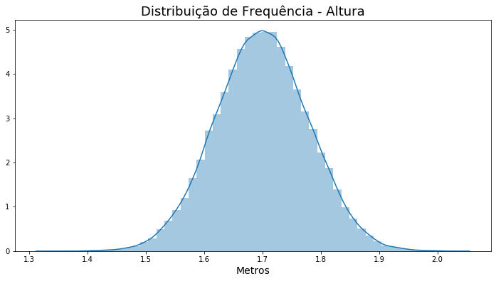
​    


```python
ax = sns.distplot(dados.Altura, kde=True)
ax.figure.set_size_inches(12, 6)
ax.set_title('Distribuição de Frequência - Altura - KDE', fontsize=18)
ax.set_xlabel('Metros', fontsize=14)
ax
```


    <matplotlib.axes._subplots.AxesSubplot at 0x7f3ab0026bb0>


​    
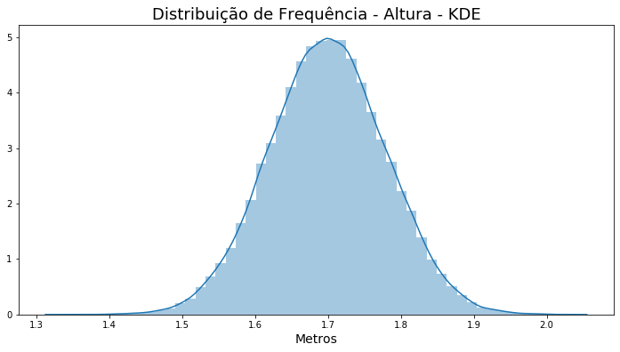
​    


```python
dados.Altura.hist(bins = 50, figsize=(12, 6))
```


    <matplotlib.axes._subplots.AxesSubplot at 0x7f3aafecadc0>


​    
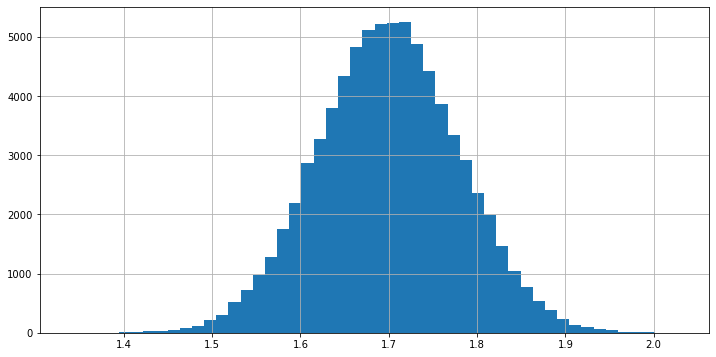
​    


```python
dist_freq_quantitativas_personalizadas.Frequencia.plot.bar(width = 1, color = 'blue', alpha = 0.2, figsize = (12, 6))
```


    <matplotlib.axes._subplots.AxesSubplot at 0x7f3aafdbb6d0>


​    
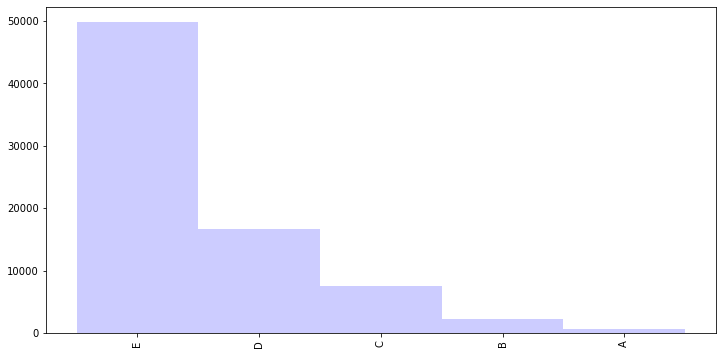
​    


# <font color=green>3 MEDIDAS DE TENDÊNCIA CENTRAL</font>
***

## DataFrame de exemplo


```python
df = pd.DataFrame(data = {'Fulano': [8, 10, 4, 8, 6, 10, 8],
                          'Beltrano': [10, 2, 0.5, 1, 3, 9.5, 10],
                          'Sicrano': [7.5, 8, 7, 8, 8, 8.5, 7]},
                  index = ['Matemática', 'Português', 'Inglês', 'Geografia', 'História', 'Física', 'Quimica']
                 )
df.rename_axis('Matérias', axis = 'columns', inplace = True)
df
```


<div>
<style scoped>
    .dataframe tbody tr th:only-of-type {
        vertical-align: middle;
    }

    .dataframe tbody tr th {
        vertical-align: top;
    }
    
    .dataframe thead th {
        text-align: right;
    }
</style>
<table border="1" class="dataframe">
  <thead>
    <tr style="text-align: right;">
      <th>Matérias</th>
      <th>Fulano</th>
      <th>Beltrano</th>
      <th>Sicrano</th>
    </tr>
  </thead>
  <tbody>
    <tr>
      <th>Matemática</th>
      <td>8</td>
      <td>10.0</td>
      <td>7.5</td>
    </tr>
    <tr>
      <th>Português</th>
      <td>10</td>
      <td>2.0</td>
      <td>8.0</td>
    </tr>
    <tr>
      <th>Inglês</th>
      <td>4</td>
      <td>0.5</td>
      <td>7.0</td>
    </tr>
    <tr>
      <th>Geografia</th>
      <td>8</td>
      <td>1.0</td>
      <td>8.0</td>
    </tr>
    <tr>
      <th>História</th>
      <td>6</td>
      <td>3.0</td>
      <td>8.0</td>
    </tr>
    <tr>
      <th>Física</th>
      <td>10</td>
      <td>9.5</td>
      <td>8.5</td>
    </tr>
    <tr>
      <th>Quimica</th>
      <td>8</td>
      <td>10.0</td>
      <td>7.0</td>
    </tr>
  </tbody>
</table>
</div>


## <font color=green>3.1 Média aritmética</font>
***

É representada por $\mu$ quando se refere à população e por $\bar{X}$ quando se refere à amostra

### $$\mu = \frac 1n\sum_{i=1}^{n}X_i$$

onde 

$n$ = número de observações (registros)

$X_i$ = valor da i-ésima observação (registro)


```python
(8 + 10 + 4 + 8 + 6 + 10 + 8)/7
```


    7.714285714285714


```python
df.Fulano.mean()
```


    7.714285714285714


```python
dados.Renda.mean()
```


    2000.3831988547631


```python
dados.groupby(['Sexo'])['Renda'].mean()
```


    Sexo
    0    2192.441596
    1    1566.847393
    Name: Renda, dtype: float64


#### Exercício


```python
dataset = pd.DataFrame({
    'Sexo': ['H', 'M', 'M', 'M', 'M', 'H', 'H', 'H', 'M', 'M'],
    'Idade': [53, 72, 54, 27, 30, 40, 58, 32, 44, 51]
})

dataset.groupby(['Sexo']).mean()
# dataset.groupby('Sexo').mean().loc['H']
```


<div>
<style scoped>
    .dataframe tbody tr th:only-of-type {
        vertical-align: middle;
    }

    .dataframe tbody tr th {
        vertical-align: top;
    }
    
    .dataframe thead th {
        text-align: right;
    }
</style>
<table border="1" class="dataframe">
  <thead>
    <tr style="text-align: right;">
      <th></th>
      <th>Idade</th>
    </tr>
    <tr>
      <th>Sexo</th>
      <th></th>
    </tr>
  </thead>
  <tbody>
    <tr>
      <th>H</th>
      <td>45.750000</td>
    </tr>
    <tr>
      <th>M</th>
      <td>46.333333</td>
    </tr>
  </tbody>
</table>
</div>


## <font color=green>3.2 Mediana</font>
***

Para obtermos a mediana de uma conjunto de dados devemos proceder da seguinte maneira:
1. Ordenar o conjunto de dados;
2. Identificar o número de observações (registros) do conjunto de dados ($n$);
3. Identicar o elemento mediano:

> Quando $n$ for ímpar, a posição do elemento mediano será obtida da seguinte forma:


### $$Elemento_{Md} = \frac{n+1}2$$

> Quando $n$ for par, a posição do elemento mediano será obtida da seguinte forma:


### $$Elemento_{Md} = \frac{n}2$$

4. Obter a mediana:

> Quando $n$ for ímpar:


### $$Md = X_{Elemento_{Md}}$$

> Quando $n$ for par:


### $$Md = \frac{X_{Elemento_{Md}} + X_{Elemento_{Md}+1}}2$$
***

### Exemplo 1 - n ímpar


```python
notas_fulano = df.Fulano
notas_fulano
```


    Matemática     8
    Português     10
    Inglês         4
    Geografia      8
    História       6
    Física        10
    Quimica        8
    Name: Fulano, dtype: int64


```python
notas_fulano = notas_fulano.sort_values()
notas_fulano
```


    Inglês         4
    História       6
    Matemática     8
    Geografia      8
    Quimica        8
    Português     10
    Física        10
    Name: Fulano, dtype: int64


```python
notas_fulano = notas_fulano.reset_index()
notas_fulano
```


<div>
<style scoped>
    .dataframe tbody tr th:only-of-type {
        vertical-align: middle;
    }

    .dataframe tbody tr th {
        vertical-align: top;
    }
    
    .dataframe thead th {
        text-align: right;
    }
</style>
<table border="1" class="dataframe">
  <thead>
    <tr style="text-align: right;">
      <th></th>
      <th>index</th>
      <th>Fulano</th>
    </tr>
  </thead>
  <tbody>
    <tr>
      <th>0</th>
      <td>Inglês</td>
      <td>4</td>
    </tr>
    <tr>
      <th>1</th>
      <td>História</td>
      <td>6</td>
    </tr>
    <tr>
      <th>2</th>
      <td>Matemática</td>
      <td>8</td>
    </tr>
    <tr>
      <th>3</th>
      <td>Geografia</td>
      <td>8</td>
    </tr>
    <tr>
      <th>4</th>
      <td>Quimica</td>
      <td>8</td>
    </tr>
    <tr>
      <th>5</th>
      <td>Português</td>
      <td>10</td>
    </tr>
    <tr>
      <th>6</th>
      <td>Física</td>
      <td>10</td>
    </tr>
  </tbody>
</table>
</div>


```python
n = notas_fulano.shape[0]
n
```


    7


```python
if n % 2 == 0:
    elemento_md = n / 2
else:
    elemento_md = (n + 1) / 2

elemento_md
```


    4.0


```python
notas_fulano.loc[elemento_md-1]
```


    index     Geografia
    Fulano            8
    Name: 3, dtype: object


```python
notas_fulano.median()
```

    /tmp/ipykernel_612268/2460163259.py:1: FutureWarning: Dropping of nuisance columns in DataFrame reductions (with 'numeric_only=None') is deprecated; in a future version this will raise TypeError.  Select only valid columns before calling the reduction.
      notas_fulano.median()


    Fulano    8.0
    dtype: float64


### Exemplo 2 - n par


```python
notas_beltrano = df.Beltrano.sample(6, random_state=101)

```


```python
notas_beltrano = notas_beltrano.sort_values()
notas_beltrano = notas_beltrano.reset_index()
notas_beltrano
```


<div>
<style scoped>
    .dataframe tbody tr th:only-of-type {
        vertical-align: middle;
    }

    .dataframe tbody tr th {
        vertical-align: top;
    }
    
    .dataframe thead th {
        text-align: right;
    }
</style>
<table border="1" class="dataframe">
  <thead>
    <tr style="text-align: right;">
      <th></th>
      <th>index</th>
      <th>Beltrano</th>
    </tr>
  </thead>
  <tbody>
    <tr>
      <th>0</th>
      <td>Inglês</td>
      <td>0.5</td>
    </tr>
    <tr>
      <th>1</th>
      <td>Português</td>
      <td>2.0</td>
    </tr>
    <tr>
      <th>2</th>
      <td>História</td>
      <td>3.0</td>
    </tr>
    <tr>
      <th>3</th>
      <td>Física</td>
      <td>9.5</td>
    </tr>
    <tr>
      <th>4</th>
      <td>Matemática</td>
      <td>10.0</td>
    </tr>
    <tr>
      <th>5</th>
      <td>Quimica</td>
      <td>10.0</td>
    </tr>
  </tbody>
</table>
</div>


```python
n = notas_beltrano.shape[0]
n
```


    6


```python
elemento_md_beltrano = n / 2
elemento_md_beltrano

```


    3.0


```python
notas_beltrano.loc
```


    <pandas.core.indexing._LocIndexer at 0x7f3aafd47810>


```python
md_beltrano = (notas_beltrano.loc[elemento_md_beltrano-1].values[1] + notas_beltrano.loc[elemento_md_beltrano].values[1]) / 2
md_beltrano
```


    6.25


```python
notas_beltrano.median()
```

    /tmp/ipykernel_612268/2014028295.py:1: FutureWarning: Dropping of nuisance columns in DataFrame reductions (with 'numeric_only=None') is deprecated; in a future version this will raise TypeError.  Select only valid columns before calling the reduction.
      notas_beltrano.median()


    Beltrano    6.25
    dtype: float64


### Obtendo a mediana em nosso dataset


```python
dados.Renda.median()
```


    1200.0


```python
dados.Renda.quantile()
```


    1200.0


## <font color=green>3.3 Moda</font>
***

Pode-se definir a moda como sendo o valor mais frequente de um conjunto de dados. A moda é bastante utilizada para dados qualitativos.


```python
df
```


<div>
<style scoped>
    .dataframe tbody tr th:only-of-type {
        vertical-align: middle;
    }

    .dataframe tbody tr th {
        vertical-align: top;
    }
    
    .dataframe thead th {
        text-align: right;
    }
</style>
<table border="1" class="dataframe">
  <thead>
    <tr style="text-align: right;">
      <th>Matérias</th>
      <th>Fulano</th>
      <th>Beltrano</th>
      <th>Sicrano</th>
    </tr>
  </thead>
  <tbody>
    <tr>
      <th>Matemática</th>
      <td>8</td>
      <td>10.0</td>
      <td>7.5</td>
    </tr>
    <tr>
      <th>Português</th>
      <td>10</td>
      <td>2.0</td>
      <td>8.0</td>
    </tr>
    <tr>
      <th>Inglês</th>
      <td>4</td>
      <td>0.5</td>
      <td>7.0</td>
    </tr>
    <tr>
      <th>Geografia</th>
      <td>8</td>
      <td>1.0</td>
      <td>8.0</td>
    </tr>
    <tr>
      <th>História</th>
      <td>6</td>
      <td>3.0</td>
      <td>8.0</td>
    </tr>
    <tr>
      <th>Física</th>
      <td>10</td>
      <td>9.5</td>
      <td>8.5</td>
    </tr>
    <tr>
      <th>Quimica</th>
      <td>8</td>
      <td>10.0</td>
      <td>7.0</td>
    </tr>
  </tbody>
</table>
</div>


```python
df.mode()
```


<div>
<style scoped>
    .dataframe tbody tr th:only-of-type {
        vertical-align: middle;
    }

    .dataframe tbody tr th {
        vertical-align: top;
    }
    
    .dataframe thead th {
        text-align: right;
    }
</style>
<table border="1" class="dataframe">
  <thead>
    <tr style="text-align: right;">
      <th>Matérias</th>
      <th>Fulano</th>
      <th>Beltrano</th>
      <th>Sicrano</th>
    </tr>
  </thead>
  <tbody>
    <tr>
      <th>0</th>
      <td>8</td>
      <td>10.0</td>
      <td>8.0</td>
    </tr>
  </tbody>
</table>
</div>


```python
exemplo = pd.Series([1, 2, 2, 3, 4, 4, 5, 6, 7])
exemplo.mode()
```


    0    2
    1    4
    dtype: int64


### Obtendo a moda em nosso dataset


```python
dados.Renda.mode()
```


    0    788
    dtype: int64


```python
dados.Idade.mode()
```


    0    40
    dtype: int64


## <font color=green>3.4 Relação entre média, mediana e moda</font>
***


### Avaliando a variável RENDA


```python
media_renda = dados.Renda.mean()
mediana_renda = dados.Renda.median()
moda_renda = dados.Renda.mode()[0]

print('Média da Renda: ', round(media_renda, 2), '\n',
      'Mediana da Renda: ', mediana_renda, '\n',
      'Moda da Renda: ', moda_renda)
```

    Média da Renda:  2000.38 
     Mediana da Renda:  1200.0 
     Moda da Renda:  788


```python
ax = sns.distplot(dados.query('Renda < 20000').Renda, kde=True)
ax.figure.set_size_inches(12, 6)
ax
```


    <matplotlib.axes._subplots.AxesSubplot at 0x7f3aafce5700>


​    
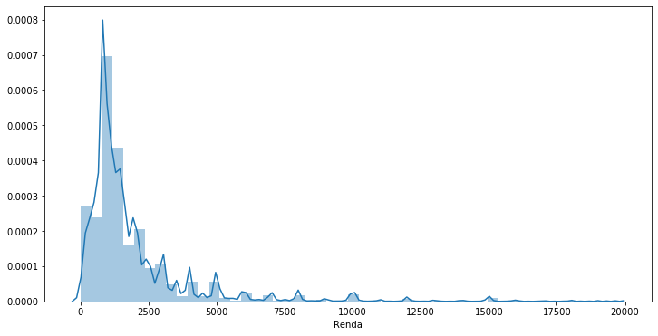
​    


```python
media_renda = dados.Renda.mean()
media_renda
```


    2000.3831988547631


```python
mediana_renda = dados.Renda.median()
mediana_renda
```


    1200.0


```python
moda_renda = dados.Renda.mode()[0]
moda_renda
```


    788


```python
media_renda > mediana_renda > moda_renda
```


    True


***

### Avaliando a variável ALTURA


```python
ax = sns.distplot(dados.Altura, kde=True)
ax.figure.set_size_inches(12, 6)
ax
```


    <matplotlib.axes._subplots.AxesSubplot at 0x7f3aaf941a00>


​    
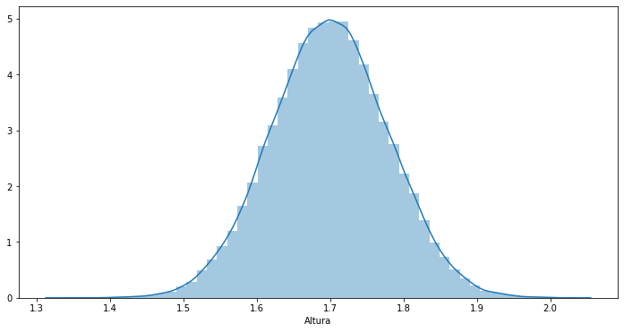
​    


```python
moda_altura = dados.Altura.mode()
moda_altura
```


    0    1.568128
    1    1.671225
    2    1.681659
    3    1.692977
    4    1.708163
    5    1.708370
    6    1.753842
    7    1.779073
    8    1.796462
    dtype: float64


```python
mediana_altura = dados.Altura.median()
mediana_altura
```


    1.6993247325


```python
media_altura = dados.Altura.mean()
media_altura
```


    1.6995124540575741


***

### Avaliando a variável ANOS DE ESTUDO


```python
ax = sns.distplot(dados['Anos de Estudo'], bins=17, kde=True)
ax.figure.set_size_inches(12, 6)
ax
```


    <matplotlib.axes._subplots.AxesSubplot at 0x7f3aafc07340>


​    
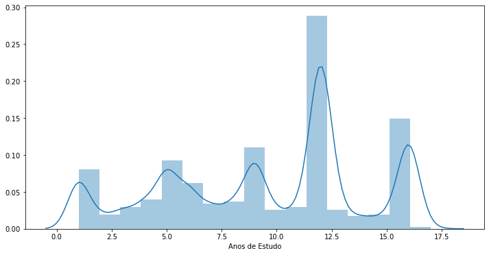
​    


```python
moda_estudo = dados['Anos de Estudo'].mode()[0]
moda_estudo
```


    12


```python
mediana_estudo = dados['Anos de Estudo'].median()
mediana_estudo
```


    11.0


```python
media_estudo = dados['Anos de Estudo'].mean()
media_estudo
```


    9.469664237376367


```python
moda_estudo > mediana_estudo > media_estudo
```


    True


# <font color=green>4 MEDIDAS SEPARATRIZES</font>
***

## <font color=green>4.1 Quartis, decis e percentis</font>
***

Há uma série de medidas de posição semelhantes na sua concepção à mediana, embora não sejam medidas de tendência central. Como se sabe, a mediana divide a distribuição em duas partes iguais quanto ao número de elementos de cada parte. Já os quartis permitem dividir a distribuição em quatro partes iguais quanto ao número de elementos de cada uma; os decis em dez partes e os centis em cem partes iguais.


```python
dados.Renda.quantile([0.25, 0.5, 0.75])
```


    0.25     788.0
    0.50    1200.0
    0.75    2000.0
    Name: Renda, dtype: float64


```python
dados.Renda.quantile([i/10 for i in range(1,10)])
```


    0.1     350.0
    0.2     788.0
    0.3     800.0
    0.4    1000.0
    0.5    1200.0
    0.6    1500.0
    0.7    1900.0
    0.8    2500.0
    0.9    4000.0
    Name: Renda, dtype: float64


```python
dados.Renda.quantile([i/100 for i in range(1,100)])
```


    0.01        0.0
    0.02        0.0
    0.03        0.0
    0.04       50.0
    0.05      100.0
             ...   
    0.95     6000.0
    0.96     7000.0
    0.97     8000.0
    0.98    10000.0
    0.99    15000.0
    Name: Renda, Length: 99, dtype: float64


```python
import statsmodels
ax = sns.distplot(dados.Idade,
                  hist_kws = {'cumulative': True},
                  kde_kws = {'cumulative': True},
                  bins = 10)
ax.figure.set_size_inches(14, 6)
ax.set_title('Distribuição de Frequência Acumulada', fontsize = 18)
ax.set_ylabel('Acumulado', fontsize = 14)
ax.set_xlabel('Anos', fontsize = 14)
ax
```


    <matplotlib.axes._subplots.AxesSubplot at 0x7f3aafb85220>


​    
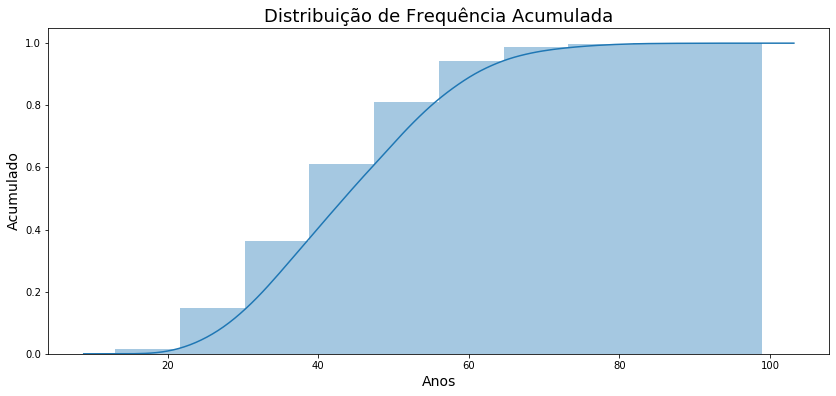
​    


```python
dados.Idade.quantile([i / 10 for i in range(1, 10)])
```


    0.1    28.0
    0.2    33.0
    0.3    36.0
    0.4    40.0
    0.5    43.0
    0.6    47.0
    0.7    51.0
    0.8    55.0
    0.9    61.0
    Name: Idade, dtype: float64


## <font color=green>4.2 Box-plot</font>
***

O box plot dá uma idéia da posição, dispersão, assimetria, caudas e dados discrepantes (outliers). A posição central é dada pela mediana e a dispersão por $IIQ$. As posições relativas de $Q1$, $Mediana$ e $Q3$ dão uma noção da simetria da distribuição. Os comprimentos das cauda são dados pelas linhas que vão do retângulo aos valores remotos e pelos valores atípicos.


```python
ax = sns.boxplot(x = 'Altura', data=dados, orient='h')
ax.figure.set_size_inches(12, 4)
ax.set_title('Altura', fontsize = 18)
ax.set_xlabel('Metros', fontsize = 14)
ax
```


    <matplotlib.axes._subplots.AxesSubplot at 0x7f3aafaf7400>


​    
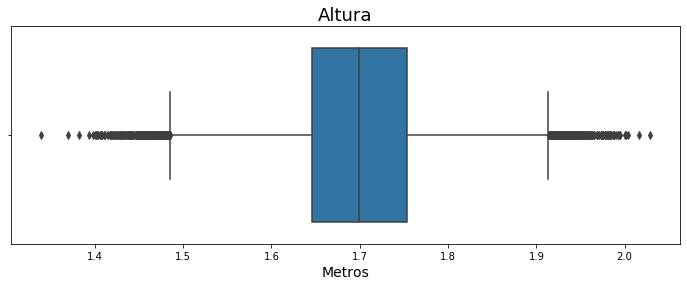
​    


```python
ax = sns.boxplot(x = 'Altura', y = 'Sexo', data=dados, orient='h')
ax.figure.set_size_inches(12, 4)
ax.set_title('Altura', fontsize = 18)
ax.set_xlabel('Metros', fontsize = 14)
ax
```


    <matplotlib.axes._subplots.AxesSubplot at 0x7f3aafad9760>


​    
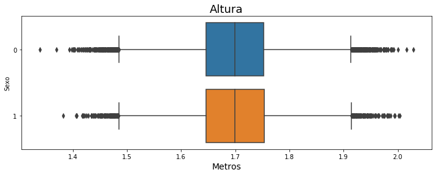
​    


```python
ax = sns.boxplot(x = 'Renda', data=dados.query('Renda < 10000'), orient='h')
ax.figure.set_size_inches(12, 4)
ax.set_title('Renda', fontsize = 18)
ax.set_xlabel('R$', fontsize = 14)
ax
```


    <matplotlib.axes._subplots.AxesSubplot at 0x7f3aafa35970>


​    
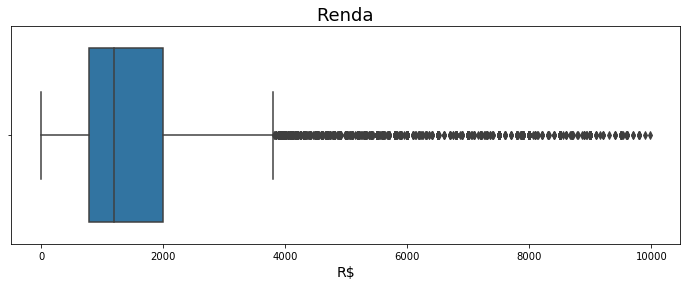
​    


```python
ax = sns.boxplot(x = 'Renda', y = 'Sexo', data=dados.query('Renda < 10000'), orient='h')
ax.figure.set_size_inches(12, 4)
ax.set_title('Renda', fontsize = 18)
ax.set_xlabel('R$', fontsize = 14)
ax
```


    <matplotlib.axes._subplots.AxesSubplot at 0x7f3aafa16b50>


​    
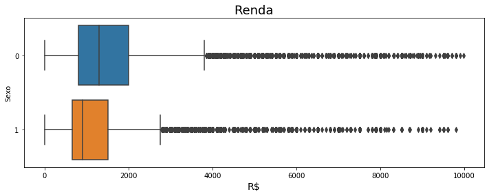
​    


```python
ax = sns.boxplot(x = 'Anos de Estudo', data=dados, orient='h')
ax.figure.set_size_inches(12, 4)
ax.set_title('Anos de Estudo', fontsize = 18)
ax.set_xlabel('Anos', fontsize = 14)
ax
```


    <matplotlib.axes._subplots.AxesSubplot at 0x7f3aaf988790>


​    
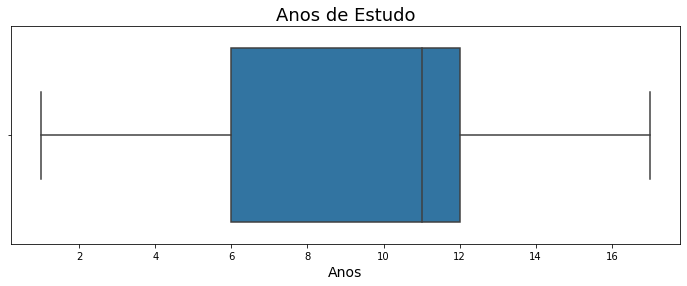
​    


```python
ax = sns.boxplot(x = 'Anos de Estudo', y = 'Sexo', data=dados, orient='h')
ax.figure.set_size_inches(12, 4)
ax.set_title('Anos de Estudo', fontsize = 18)
ax.set_xlabel('Anos', fontsize = 14)
ax
```


    <matplotlib.axes._subplots.AxesSubplot at 0x7f3aaf82b100>


​    
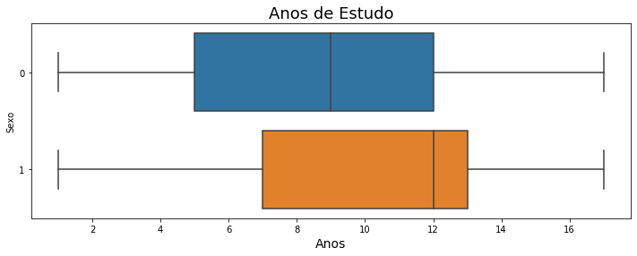
​    


# <font color=green>5 MEDIDAS DE DISPERSÃO</font>
***

Embora as medidas de posição forneçam uma sumarização bastante importante dos dados, elas podem não ser suficientes para caracterizar conjuntos distintos, especialmente quando as observações de determinada distribuição apresentarem dados muito dispersos.

## <font color=green>5.1 Desvio médio absoluto</font>
***


### $$DM = \frac 1n\sum_{i=1}^{n}|X_i-\bar{X}|$$


```python
df
```


<div>
<style scoped>
    .dataframe tbody tr th:only-of-type {
        vertical-align: middle;
    }

    .dataframe tbody tr th {
        vertical-align: top;
    }
    
    .dataframe thead th {
        text-align: right;
    }
</style>
<table border="1" class="dataframe">
  <thead>
    <tr style="text-align: right;">
      <th>Matérias</th>
      <th>Fulano</th>
      <th>Beltrano</th>
      <th>Sicrano</th>
    </tr>
  </thead>
  <tbody>
    <tr>
      <th>Matemática</th>
      <td>8</td>
      <td>10.0</td>
      <td>7.5</td>
    </tr>
    <tr>
      <th>Português</th>
      <td>10</td>
      <td>2.0</td>
      <td>8.0</td>
    </tr>
    <tr>
      <th>Inglês</th>
      <td>4</td>
      <td>0.5</td>
      <td>7.0</td>
    </tr>
    <tr>
      <th>Geografia</th>
      <td>8</td>
      <td>1.0</td>
      <td>8.0</td>
    </tr>
    <tr>
      <th>História</th>
      <td>6</td>
      <td>3.0</td>
      <td>8.0</td>
    </tr>
    <tr>
      <th>Física</th>
      <td>10</td>
      <td>9.5</td>
      <td>8.5</td>
    </tr>
    <tr>
      <th>Quimica</th>
      <td>8</td>
      <td>10.0</td>
      <td>7.0</td>
    </tr>
  </tbody>
</table>
</div>


```python
notas_fulano = df[['Fulano']]
notas_fulano
```


<div>
<style scoped>
    .dataframe tbody tr th:only-of-type {
        vertical-align: middle;
    }

    .dataframe tbody tr th {
        vertical-align: top;
    }
    
    .dataframe thead th {
        text-align: right;
    }
</style>
<table border="1" class="dataframe">
  <thead>
    <tr style="text-align: right;">
      <th>Matérias</th>
      <th>Fulano</th>
    </tr>
  </thead>
  <tbody>
    <tr>
      <th>Matemática</th>
      <td>8</td>
    </tr>
    <tr>
      <th>Português</th>
      <td>10</td>
    </tr>
    <tr>
      <th>Inglês</th>
      <td>4</td>
    </tr>
    <tr>
      <th>Geografia</th>
      <td>8</td>
    </tr>
    <tr>
      <th>História</th>
      <td>6</td>
    </tr>
    <tr>
      <th>Física</th>
      <td>10</td>
    </tr>
    <tr>
      <th>Quimica</th>
      <td>8</td>
    </tr>
  </tbody>
</table>
</div>


```python
nota_media_fulano = notas_fulano.mean()[0]
nota_media_fulano
```


    7.714285714285714


```python
notas_fulano['Desvio'] = notas_fulano['Fulano'] - nota_media_fulano
notas_fulano
```

    /tmp/ipykernel_612268/349761232.py:1: SettingWithCopyWarning: 
    A value is trying to be set on a copy of a slice from a DataFrame.
    Try using .loc[row_indexer,col_indexer] = value instead
    
    See the caveats in the documentation: https://pandas.pydata.org/pandas-docs/stable/user_guide/indexing.html#returning-a-view-versus-a-copy
      notas_fulano['Desvio'] = notas_fulano['Fulano'] - nota_media_fulano


<div>
<style scoped>
    .dataframe tbody tr th:only-of-type {
        vertical-align: middle;
    }

    .dataframe tbody tr th {
        vertical-align: top;
    }
    
    .dataframe thead th {
        text-align: right;
    }
</style>
<table border="1" class="dataframe">
  <thead>
    <tr style="text-align: right;">
      <th>Matérias</th>
      <th>Fulano</th>
      <th>Desvio</th>
    </tr>
  </thead>
  <tbody>
    <tr>
      <th>Matemática</th>
      <td>8</td>
      <td>0.285714</td>
    </tr>
    <tr>
      <th>Português</th>
      <td>10</td>
      <td>2.285714</td>
    </tr>
    <tr>
      <th>Inglês</th>
      <td>4</td>
      <td>-3.714286</td>
    </tr>
    <tr>
      <th>Geografia</th>
      <td>8</td>
      <td>0.285714</td>
    </tr>
    <tr>
      <th>História</th>
      <td>6</td>
      <td>-1.714286</td>
    </tr>
    <tr>
      <th>Física</th>
      <td>10</td>
      <td>2.285714</td>
    </tr>
    <tr>
      <th>Quimica</th>
      <td>8</td>
      <td>0.285714</td>
    </tr>
  </tbody>
</table>
</div>


```python
notas_fulano['Desvio'].sum()
```


    -8.881784197001252e-16


```python
notas_fulano['|Desvio|'] = notas_fulano['Desvio'].abs()
notas_fulano
```


<div>
<style scoped>
    .dataframe tbody tr th:only-of-type {
        vertical-align: middle;
    }

    .dataframe tbody tr th {
        vertical-align: top;
    }
    
    .dataframe thead th {
        text-align: right;
    }
</style>
<table border="1" class="dataframe">
  <thead>
    <tr style="text-align: right;">
      <th>Matérias</th>
      <th>Fulano</th>
      <th>Desvio</th>
      <th>|Desvio|</th>
    </tr>
  </thead>
  <tbody>
    <tr>
      <th>Matemática</th>
      <td>8</td>
      <td>0.285714</td>
      <td>0.285714</td>
    </tr>
    <tr>
      <th>Português</th>
      <td>10</td>
      <td>2.285714</td>
      <td>2.285714</td>
    </tr>
    <tr>
      <th>Inglês</th>
      <td>4</td>
      <td>3.714286</td>
      <td>3.714286</td>
    </tr>
    <tr>
      <th>Geografia</th>
      <td>8</td>
      <td>0.285714</td>
      <td>0.285714</td>
    </tr>
    <tr>
      <th>História</th>
      <td>6</td>
      <td>1.714286</td>
      <td>1.714286</td>
    </tr>
    <tr>
      <th>Física</th>
      <td>10</td>
      <td>2.285714</td>
      <td>2.285714</td>
    </tr>
    <tr>
      <th>Quimica</th>
      <td>8</td>
      <td>0.285714</td>
      <td>0.285714</td>
    </tr>
  </tbody>
</table>
</div>


```python
ax = notas_fulano['Fulano'].plot(style = 'o')
ax.figure.set_size_inches(14, 6)
ax.hlines(y = nota_media_fulano, xmin = 0, xmax = notas_fulano.shape[0] - 1)
for i in range(notas_fulano.shape[0]):
    ax.vlines(x = i, ymin = nota_media_fulano, ymax = notas_fulano['Fulano'][i], linestyle = 'dashed')
ax
```


    <matplotlib.axes._subplots.AxesSubplot at 0x7f3aae8581f0>


​    
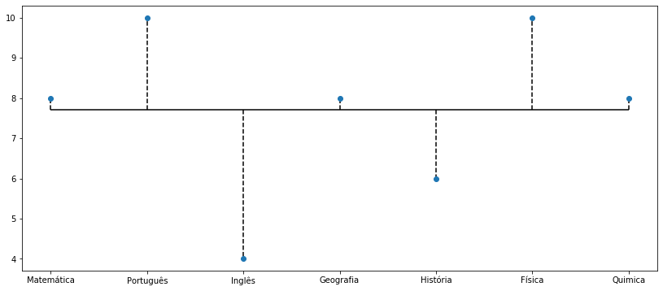
​    


```python
notas_fulano['|Desvio|'].mean()
```


    1.5510204081632648


```python
desvio_medio_absoluto = notas_fulano['Fulano'].mad()
desvio_medio_absoluto
```


    1.5510204081632648


### Exercício


```python
df
```


<div>
<style scoped>
    .dataframe tbody tr th:only-of-type {
        vertical-align: middle;
    }

    .dataframe tbody tr th {
        vertical-align: top;
    }
    
    .dataframe thead th {
        text-align: right;
    }
</style>
<table border="1" class="dataframe">
  <thead>
    <tr style="text-align: right;">
      <th>Matérias</th>
      <th>Fulano</th>
      <th>Sicrano</th>
    </tr>
  </thead>
  <tbody>
    <tr>
      <th>Matemática</th>
      <td>8</td>
      <td>7.5</td>
    </tr>
    <tr>
      <th>Português</th>
      <td>10</td>
      <td>8.0</td>
    </tr>
    <tr>
      <th>Inglês</th>
      <td>4</td>
      <td>7.0</td>
    </tr>
    <tr>
      <th>Geografia</th>
      <td>8</td>
      <td>8.0</td>
    </tr>
    <tr>
      <th>História</th>
      <td>6</td>
      <td>8.0</td>
    </tr>
    <tr>
      <th>Física</th>
      <td>10</td>
      <td>8.5</td>
    </tr>
    <tr>
      <th>Química</th>
      <td>8</td>
      <td>7.0</td>
    </tr>
  </tbody>
</table>
</div>


```python
df['Sicrano'].mad()
```


    0.4693877551020408


## <font color=green>5.2 Variância</font>
***

### Variância

A variância é construída a partir das diferenças entre cada observação e a média dos dados, ou seja, o desvio em torno da média. No cálculo da variância, os desvios em torno da média são elevados ao quadrado.

### Variância populacional

#### $$\sigma^2 = \frac 1n\sum_{i=1}^{n}(X_i-\mu)^2$$

### Variância amostral

#### $$S^2 = \frac 1{n-1}\sum_{i=1}^{n}(X_i-\bar{X})^2$$


```python
notas_fulano['(Desvio)^2'] = notas_fulano['Desvio'].pow(2)
notas_fulano
```


<div>
<style scoped>
    .dataframe tbody tr th:only-of-type {
        vertical-align: middle;
    }

    .dataframe tbody tr th {
        vertical-align: top;
    }
    
    .dataframe thead th {
        text-align: right;
    }
</style>
<table border="1" class="dataframe">
  <thead>
    <tr style="text-align: right;">
      <th>Matérias</th>
      <th>Fulano</th>
      <th>Desvio</th>
      <th>|Desvio|</th>
      <th>(Desvio)^2</th>
    </tr>
  </thead>
  <tbody>
    <tr>
      <th>Matemática</th>
      <td>8</td>
      <td>0.285714</td>
      <td>0.285714</td>
      <td>0.081633</td>
    </tr>
    <tr>
      <th>Português</th>
      <td>10</td>
      <td>2.285714</td>
      <td>2.285714</td>
      <td>5.224490</td>
    </tr>
    <tr>
      <th>Inglês</th>
      <td>4</td>
      <td>3.714286</td>
      <td>3.714286</td>
      <td>13.795918</td>
    </tr>
    <tr>
      <th>Geografia</th>
      <td>8</td>
      <td>0.285714</td>
      <td>0.285714</td>
      <td>0.081633</td>
    </tr>
    <tr>
      <th>História</th>
      <td>6</td>
      <td>1.714286</td>
      <td>1.714286</td>
      <td>2.938776</td>
    </tr>
    <tr>
      <th>Física</th>
      <td>10</td>
      <td>2.285714</td>
      <td>2.285714</td>
      <td>5.224490</td>
    </tr>
    <tr>
      <th>Quimica</th>
      <td>8</td>
      <td>0.285714</td>
      <td>0.285714</td>
      <td>0.081633</td>
    </tr>
  </tbody>
</table>
</div>


```python
notas_fulano['(Desvio)^2'].sum() / (len(notas_fulano) - 1)
```


    4.57142857142857


```python
variancia = notas_fulano['Fulano'].var()
variancia
```


    4.57142857142857


## <font color=green>5.3 Desvio padrão</font>
***

Uma das restrições da variância é o fato de fornecer medidas em quadrados das unidades originais - a variância de medidas de comprimento, por exemplo, é em unidades de área. Logo, o fato de as unidades serem diferentes dificulta a comparação da dispersão com as variáveis que a definem. Um modo de eliminar essa dificuldade é considerar sua raiz quadrada.

### Desvio padrão populacional

#### $$\sigma = \sqrt{\frac 1n\sum_{i=1}^{n}(X_i-\mu)^2} \Longrightarrow \sigma = \sqrt{\sigma^2}$$

### Desvio padrão amostral

#### $$S = \sqrt{\frac 1{n-1}\sum_{i=1}^{n}(X_i-\bar{X})^2} \Longrightarrow S = \sqrt{S^2}$$


```python
np.sqrt(variancia)
```


    2.1380899352993947


```python
desvio_padrao = notas_fulano['Fulano'].std()
desvio_padrao
```


    2.1380899352993947


```python
df
```


<div>
<style scoped>
    .dataframe tbody tr th:only-of-type {
        vertical-align: middle;
    }

    .dataframe tbody tr th {
        vertical-align: top;
    }
    
    .dataframe thead th {
        text-align: right;
    }
</style>
<table border="1" class="dataframe">
  <thead>
    <tr style="text-align: right;">
      <th>Matérias</th>
      <th>Fulano</th>
      <th>Beltrano</th>
      <th>Sicrano</th>
    </tr>
  </thead>
  <tbody>
    <tr>
      <th>Matemática</th>
      <td>8</td>
      <td>10.0</td>
      <td>7.5</td>
    </tr>
    <tr>
      <th>Português</th>
      <td>10</td>
      <td>2.0</td>
      <td>8.0</td>
    </tr>
    <tr>
      <th>Inglês</th>
      <td>4</td>
      <td>0.5</td>
      <td>7.0</td>
    </tr>
    <tr>
      <th>Geografia</th>
      <td>8</td>
      <td>1.0</td>
      <td>8.0</td>
    </tr>
    <tr>
      <th>História</th>
      <td>6</td>
      <td>3.0</td>
      <td>8.0</td>
    </tr>
    <tr>
      <th>Física</th>
      <td>10</td>
      <td>9.5</td>
      <td>8.5</td>
    </tr>
    <tr>
      <th>Quimica</th>
      <td>8</td>
      <td>10.0</td>
      <td>7.0</td>
    </tr>
  </tbody>
</table>
</div>


```python
df.mean()
```


    Matérias
    Fulano      7.714286
    Beltrano    5.142857
    Sicrano     7.714286
    dtype: float64


```python
df.median()
```


    Matérias
    Fulano      8.0
    Beltrano    3.0
    Sicrano     8.0
    dtype: float64


```python
df.mode()
```


<div>
<style scoped>
    .dataframe tbody tr th:only-of-type {
        vertical-align: middle;
    }

    .dataframe tbody tr th {
        vertical-align: top;
    }
    
    .dataframe thead th {
        text-align: right;
    }
</style>
<table border="1" class="dataframe">
  <thead>
    <tr style="text-align: right;">
      <th>Matérias</th>
      <th>Fulano</th>
      <th>Beltrano</th>
      <th>Sicrano</th>
    </tr>
  </thead>
  <tbody>
    <tr>
      <th>0</th>
      <td>8</td>
      <td>10.0</td>
      <td>8.0</td>
    </tr>
  </tbody>
</table>
</div>


```python
df.std()
```


    Matérias
    Fulano      2.138090
    Beltrano    4.460141
    Sicrano     0.566947
    dtype: float64


### Exercício


```python
dataset = pd.DataFrame({
    'Sexo': ['H', 'M', 'M', 'M', 'M', 'H', 'H', 'H', 'M', 'M'],
    'Idade': [53, 72, 54, 27, 30, 40, 58, 32, 44, 51]
})
dataset
```


<div>
<style scoped>
    .dataframe tbody tr th:only-of-type {
        vertical-align: middle;
    }

    .dataframe tbody tr th {
        vertical-align: top;
    }
    
    .dataframe thead th {
        text-align: right;
    }
</style>
<table border="1" class="dataframe">
  <thead>
    <tr style="text-align: right;">
      <th></th>
      <th>Sexo</th>
      <th>Idade</th>
    </tr>
  </thead>
  <tbody>
    <tr>
      <th>0</th>
      <td>H</td>
      <td>53</td>
    </tr>
    <tr>
      <th>1</th>
      <td>M</td>
      <td>72</td>
    </tr>
    <tr>
      <th>2</th>
      <td>M</td>
      <td>54</td>
    </tr>
    <tr>
      <th>3</th>
      <td>M</td>
      <td>27</td>
    </tr>
    <tr>
      <th>4</th>
      <td>M</td>
      <td>30</td>
    </tr>
    <tr>
      <th>5</th>
      <td>H</td>
      <td>40</td>
    </tr>
    <tr>
      <th>6</th>
      <td>H</td>
      <td>58</td>
    </tr>
    <tr>
      <th>7</th>
      <td>H</td>
      <td>32</td>
    </tr>
    <tr>
      <th>8</th>
      <td>M</td>
      <td>44</td>
    </tr>
    <tr>
      <th>9</th>
      <td>M</td>
      <td>51</td>
    </tr>
  </tbody>
</table>
</div>


```python
dataset.std()
```

    /tmp/ipykernel_612268/178401259.py:1: FutureWarning: Dropping of nuisance columns in DataFrame reductions (with 'numeric_only=None') is deprecated; in a future version this will raise TypeError.  Select only valid columns before calling the reduction.
      dataset.std()


    Idade    14.18489
    dtype: float64


```python
dataset.query('Sexo == "M"')['Idade'].std()
```


    16.64531966249572


```python
dataset.groupby(['Sexo']).std().loc['M']
```


    Idade    16.64532
    Name: M, dtype: float64


```python

```
